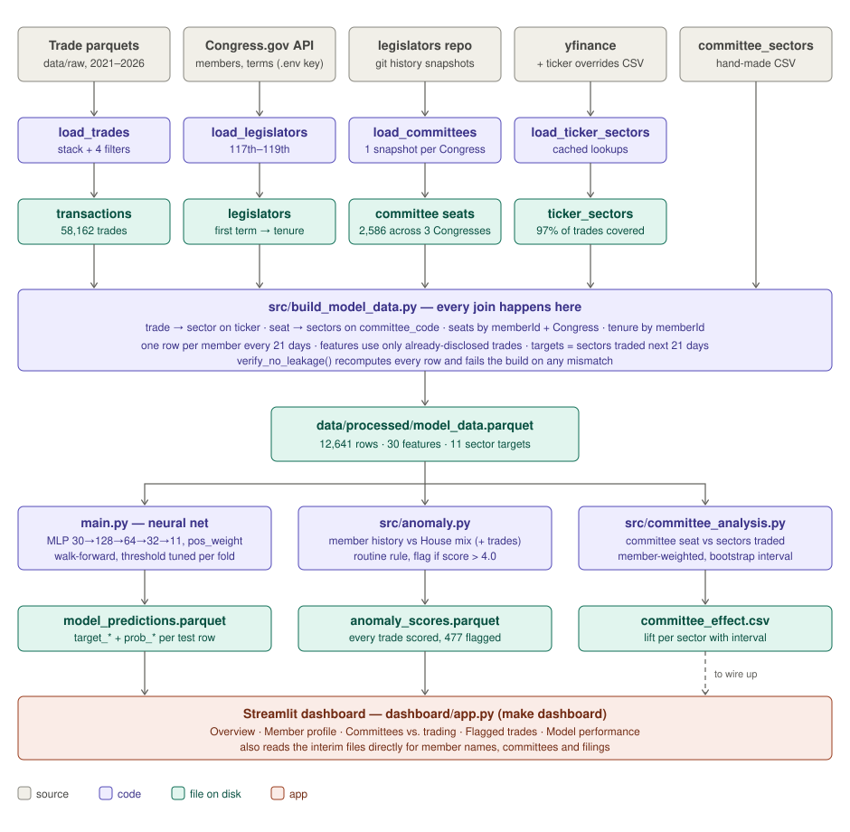

# How PoliPicks works



```bash
source .venv/bin/activate            # Python 3.12+, pip install -r requirements.txt
make data                            # sources → model_data.parquet (~1 min)
make train                           # neural net → model_predictions.parquet
make anomalies                       # → anomaly_scores.parquet
make committee-analysis              # → committee_effect.csv
make baselines                       # comparison models (~4 min)
make dashboard                       # Streamlit app (dashboard branch)
```

## 1. Sources → interim files

Each loader cleans one source and writes one file. Nothing is joined yet.

| Script | Reads | Writes | Notes |
|---|---|---|---|
| `src/load_trades.py` | six yearly parquets in `data/raw/` | `data/interim/transactions.parquet` | Drops amended-away rows, Senate, rows with no ticker, trades outside 2021-01-01 to 2026-09-30. 78,506 → **58,162 trades**, 201 members, 2,643 tickers. Keeps `available_at`, the date each trade became public. |
| `src/load_legislators.py` | Congress.gov API (key in `.env`) | `legislators.parquet` | House members of the 117th–119th Congresses; first term start gives tenure. |
| `src/load_committee_snapshots.py` | git history of the [congress-legislators](https://github.com/unitedstates/congress-legislators) repo | `committee_assignments.parquet` | The repo only ships *current* membership, so each Congress uses the last commit before a cutoff: 2021-03-15, 2023-03-01, 2025-04-01. 2,586 seats. |
| `src/load_ticker_sectors.py` | yfinance + `config/ticker_sector_overrides.csv` | `ticker_sectors.parquet` | Yahoo has nothing for delisted/renamed companies (FB, ATVI, SIVB…), so 220 tickers are assigned by hand; funds are marked `fund` with no sector. 97% of trades get a sector. |

`config/committee_sectors.csv` (hand-made) maps each House committee to the GICS sectors it oversees.

## 2. The join: `src/build_model_data.py`

All joining happens in this one script. Every House member who traded gets one row every 21 days ("prediction date"), from 2021-01-25 to 2026-07-13.

| Join | Key | Gives |
|---|---|---|
| trades ⋈ ticker_sectors | `ticker` | the sector of each trade |
| committee_assignments ⋈ committee_sectors.csv | `committee_code` | the sectors each member oversees, per Congress |
| member row ⋈ committee sectors | `memberId` + the Congress of the prediction date | 11 committee flags |
| member row ⋈ legislators | `memberId` | tenure in years |

For each member and prediction date *d*:

- **Features** count only trades that were **public before *d*** (`available_at < d`). The median trade is disclosed 28 days after it happens, which is longer than the window, so counting by trade date would leak the future.
- **Targets** are the sectors the member traded in **[*d*, *d* + 21 days)**, by trade date.
- Prediction dates stop 45 days (the STOCK Act deadline) plus one window before the data was pulled, because recent trades aren't all disclosed yet.
- `verify_no_leakage()` recomputes every row a second way and fails the build if anything differs.

Output: `data/processed/model_data.parquet` — **12,641 rows**, 195 members, 96 prediction dates.

## 3. What the model trains on

30 features per row, 11 targets:

| Group | Columns |
|---|---|
| Activity (7) | `trades_last_21d`, `trades_last_90d`, `trades_last_365d`, `days_since_last_trade`, `avg_amount_90d`, `purchase_ratio_90d`, `sale_ratio_90d` |
| Member (1) | `tenure_years` |
| Sector history (11) | `<sector>_trades_90d` — disclosed trades per sector in the last 90 days |
| Committees (11) | `committee_<sector>` — 1 if a committee seat oversees that sector this Congress |
| **Targets (11)** | `target_<sector>` — 1 if the member traded that sector in the next 21 days |

About 4% of member-sector cells are positive, so accuracy is meaningless (predicting "no trade" everywhere is 96% accurate). We report micro F1 (every cell counts the same) and macro F1 (every sector counts the same).

## 4. The model: `main.py`

A small feedforward neural net (`src/model.py`):

```
30 inputs → 128 (BatchNorm, ReLU, dropout 0.25) → 64 (BatchNorm, ReLU, dropout 0.20) → 32 (ReLU) → 11 outputs
```

Each output is a sigmoid "will they trade this sector", so it is 11 yes/no predictions at once (multi-label), trained with binary cross-entropy and Adam.

**Walk-forward evaluation.** It's a forecast, so training data always comes before test data. Four folds test on 2023, 2024, 2025 and Q1 2026; each trains on everything up to 21 days before its test period. Within each fold:

1. Fit the feature scaler on training rows only.
2. Train on all but the last 365 days of the training period; pick the decision threshold with the best F1 on those last 365 days.
3. Retrain on the full training period and score the test period once with that threshold.

## 5. What we did to improve scores

| Step | What | Why |
|---|---|---|
| Committee snapshots | Load all three Congresses from git history | The original loader only got the 119th, so committee features were all zero for 2021–2024 |
| Disclosure dates | Features use `available_at`, not trade date | Removes look-ahead leakage; scores went *down* but became honest |
| Ticker overrides | Hand-assign 220 delisted/renamed tickers | Unknown-sector trades 7.6% → 1.3% |
| Threshold tuning | Per fold, on the last training year | A fixed 0.5 was too high for ~4% positives; biggest single gain |
| `pos_weight = sqrt(neg/pos)` | Up-weights rare sectors in the loss | Rare sectors (Utilities ~2%) were never predicted; lifts macro F1 |
| Hyperparameter sweep | 48 combinations of learning rate, epochs, weight decay, pos_weight, batch size, tuned on the last training year only | Chose lr 1e-3, 30 epochs, weight decay 1e-3, batch 256, sqrt weighting |
| Fixed seed | `SEED = 0` | Same settings → same numbers, so runs are comparable |

All settings live in `config/model_config.py`.

**Results** (mean over the four test periods):

| Model | Precision | Recall | Micro F1 | Macro F1 |
|---|---|---|---|---|
| Popular sectors for active members | 0.32 | 0.60 | 0.412 | 0.310 |
| Repeat last 90 days' sectors | 0.30 | 0.76 | 0.427 | 0.415 |
| Neural net, starting settings (threshold 0.5) | 0.66 | 0.37 | 0.475 | — |
| Logistic regression (`make baselines`) | 0.50 | 0.50 | 0.490 | 0.477 |
| **Neural net, tuned** | 0.50 | 0.52 | **0.492** | 0.470 |
| Gradient boosting (`make baselines`) | 0.53 | 0.51 | 0.514 | 0.485 |
| Neural net, tuned, **without committee features** | — | — | 0.515 | 0.503 |

## 6. Findings to know

**Committee seats don't predict trading.** Removing the committee features *improves* the model. `make committee-analysis` compares member-Congresses on vs. off an overseeing committee, weighting each member equally: for 8 of 10 sectors the 95% interval includes "no effect". The two clear results go the other way — members on committees overseeing **Energy** (0.38×) and **Utilities** (0.29×) trade those sectors *less*. Only 4–13 members switched committees per sector, too few for a within-member conclusion.

**Anomaly detection** (`src/anomaly.py`) scores each trade by how surprising its sector is given the member's own earlier trades, blended with the House-wide mix (blend weight tuned on pre-2023 trades). Sectors the member traded 3+ times in the past year count as routine and score 0. Scores above 4.0 (under ~2% chance) are flagged: 477 of 56,489 trades. Tested by moving 5% of 2023+ trades into sectors the member doesn't normally trade:

| Score | AUC, each member weighted equally |
|---|---|
| Member history | 0.78 |
| Member history + routine rule (what's flagged) | 0.83* |
| Neural net probabilities | 0.68 |

\*Optimistic: the test never moves trades into routine sectors.

## 7. Outputs → dashboard

The dashboard (`dashboard/app.py`, on the `dashboard` branch) only reads files, so rerunning a `make` step updates it.

| Output | Written by | Columns | Dashboard tab |
|---|---|---|---|
| `data/processed/model_predictions.parquet` | `make train` | `memberId`, `prediction_date`, `fold`, `threshold`, `target_<sector>` (0/1), `prob_<sector>` (0–1) | Model performance |
| `data/processed/anomaly_scores.parquet` | `make anomalies` | one row per trade: `name`, `owner`, `sector`, `anomaly_score`, `flag`, `recent_sector_trades`, `committee_sectors`, `sourceUrl`, … | Flagged trades, Member profile |
| `data/processed/committee_effect.csv` | `make committee-analysis` | `sector`, `rate_on`, `rate_off`, `lift`, `lift_ci_low`, `lift_ci_high`, `switchers` | not wired up yet (Committees vs. trading tab computes its own, unweighted version) |
| `data/interim/*.parquet`, `model_data.parquet` | `make data` | — | Overview, Member profile, Committees vs. trading |

To connect:

1. Merge the `dashboard` branch, then `make train anomalies` so both files exist.
2. Model performance: use each row's saved `threshold` instead of the slider's 0.5 default to match the reported F1.
3. Committees vs. trading: read `committee_effect.csv` to show the member-weighted lift with its interval.
